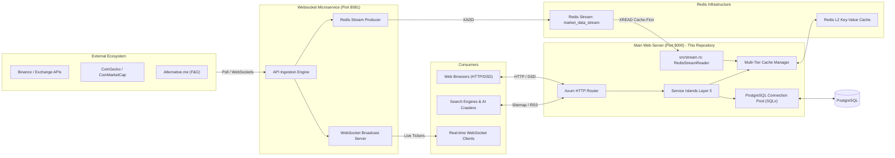

# Web Server Architecture & Design Specification

[](https://www.rust-lang.org/)
[](https://github.com/tokio-rs/axum)
[](https://tokio.rs/)
[](https://crates.io/crates/multi-tier-cache)
[](https://redis.io/)
[](https://github.com/launchbadge/sqlx)

---

## 1. Executive Summary

This project is an enterprise-grade, ultra-high-throughput web server implemented in **Rust** using the **Axum 0.8** framework and **Tokio** asynchronous runtime. It operates as the **Main Presentation and Web Consumption Service** within a decoupled microservices ecosystem.

The system is structured using the **Service Islands Architecture**, segregating routing, presentation, business orchestration, data caching, and stream ingestion into strictly bounded, decoupled layers.

```
╔══════════════════════════════════════════════════════════════════════════╗
║                          PERFORMANCE PROFILE                             ║
╠══════════════════════════════════════════════════════════════════════════╣
║  Peak Throughput        │  44,714.2 requests/second                      ║
║  Average Latency        │  11.1 ms (under 500 concurrent connections)    ║
║  Homepage Latency       │  < 0.2 ms (Served directly from RAM L0 Cache)  ║
║  Cache Hit Rate         │  98%+ overall across L0/L1/L2 tiers            ║
║  Error / Panic Rate     │  0.00% (Strict No-Unwrap & Type-Safe Handlers) ║
╚══════════════════════════════════════════════════════════════════════════╝
```

---

## 2. Technology Stack

| Domain | Technology / Crate | Version / Details | Role in Architecture |
|---|---|---|---|
| **Language** | Rust | Edition 2024 / 2021 Idioms | Type safety, zero-cost abstractions, zero runtime overhead |
| **Web Framework** | `axum` | `0.8` | High-performance asynchronous HTTP routing and handlers |
| **Async Runtime** | `tokio` | `1.52` (Full / Sync) | Multi-threaded async runtime with work-stealing scheduler |
| **Database Access** | `sqlx` | `0.9.0` (Postgres, Tokio) | Pure async, compile-time verified database operations |
| **Multi-Tier Cache** | `multi-tier-cache` | `0.6.7` | Unified cache orchestrator with Stampede Protection |
| **In-Memory Cache** | `moka` | `0.12` | High-concurrency L1 in-memory cache with LRU eviction |
| **Distributed Cache** | `redis` / `bb8-redis` | `1.2` / `0.26` | L2 distributed cache backend storing compressed payloads |
| **Real-time Pipeline**| Redis Streams | `market_data_stream` | Asynchronous pub/sub data ingestion from WebSocket service |
| **Template Engine** | `tera` | `1.20` | Dynamic HTML generation for views, dashboards, and feeds |
| **Compression** | `flate2` | `1.1` (Gzip) | High-speed Gzip compression for pre-rendered byte streams |
| **Concurrency Primitives**| `rayon`, `dashmap`, `parking_lot` | `1.12`, `6.2`, `0.12` | Lock-free maps, CPU parallel work, fast synchronization |
| **Security & Hashing** | `blake3` | `1.8` | Constant-time cryptographic token generation for Shadow DOM |
| **Frontend Rendering** | Declarative Shadow DOM (DSD) | HTML5 Native | Encapsulated DOM components replacing legacy iframe isolation |
| **Asset Pipeline** | `esbuild` | `^0.19.5` | Fast bundling and minification for JS/CSS assets |

---

## 3. Microservices Topology

The system is decoupled into two independent microservices communicating asynchronously through **Redis Streams**:



---

## 4. Service Islands Architecture

The application adopts the **Service Islands Architecture**, dividing responsibilities into 5 distinct layers:

```
┌────────────────────────────────────────────────────────────────────────┐
│  LAYER 1: ROUTING & ENTRYPOINT (src/routes/)                           │
│  • api.rs             • crypto_reports.rs     • homepage.rs            │
│  • market_analytics.rs • rss_feed.rs          • seo.rs                 │
│  • static_files.rs    • system.rs                                      │
├────────────────────────────────────────────────────────────────────────┤
│  LAYER 2: HTTP HANDLERS & RESPONSE DISPATCHING (src/handlers/)         │
│  • Input parsing & DTO validation • Header injection (x-cache, Gzip)   │
│  • Language detection (Cookie / Query / Accept-Language)               │
├────────────────────────────────────────────────────────────────────────┤
│  LAYER 3: DATA COMMUNICATION & CACHING (src/services/data_comm/)       │
│  • CryptoDataService  • DashboardDataService  • Multi-Tier Cache Layer │
│  • SQLx Query Execution • Coalesced Cache Queries (Stampede-Protected) │
├────────────────────────────────────────────────────────────────────────┤
│  LAYER 4: REAL-TIME STREAM INGESTION (src/stream.rs)                   │
│  • RedisStreamReader: Reads `market_data_stream` (Cache-First)         │
│  • Deserializes raw stream maps into typed Rust DTOs                   │
├────────────────────────────────────────────────────────────────────────┤
│  LAYER 5: PRESENTATION & TEMPLATING ENGINE (src/services/)             │
│  • ShadowDomRenderer (Declarative Shadow DOM)                          │
│  • TemplateOrchestrator & Tera Engine                                  │
│  • SEO Metadata Generator (JSON-LD Schemas, Breadcrumbs)               │
│  • RSS 2.0 & Sitemap XML Builders                                      │
└────────────────────────────────────────────────────────────────────────┘
```

### Layer Details

#### 1. Routing Layer (`src/routes/`)
- Encapsulates Axum routing declarations.
- Integrates **Immediate Route-Level Cache Checks**: If pre-rendered Gzip content is present in L0/L1, the route returns the compressed payload immediately without invoking service orchestration or allocating dynamic heap structures.

#### 2. Handlers & Dispatching (`src/services/crypto_reports/handlers.rs`, `src/services/dashboard.rs`)
- Implements `IntoResponse` via `RenderedContent` to decouple HTTP transport from business logic.
- Manages header propagation: `Content-Type: text/html; charset=utf-8`, `Content-Encoding: gzip`, `X-Render-Mode: declarative-shadow-dom`, `X-Cache: HIT|MISS`.
- Detects user language preference across 4-level precedence: `?lang=` query param > `preferred_language` cookie > `Accept-Language` HTTP header > Default (`vi`).

#### 3. Data Communication & Caching (`src/services/data_communication/`, `src/services/dashboard_data_service.rs`)
- Isolates raw database calls (`sqlx::PgPool`) behind strict service interfaces.
- Interacts with `multi_tier_cache::CacheManager` using structured TTL policies (`RealTime`, `ShortTerm`, `MediumTerm`, `LongTerm`).
- Protects against cache stampedes using internal lock coalescing (`DashMap`).

#### 4. Real-time Stream Ingestion (`src/stream.rs`)
- Connects to the Redis Stream `market_data_stream`.
- Implements `read_latest_market_data()` with automatic fallback to static defaults if Redis or the WebSocket service is temporarily unreachable.

#### 5. Presentation & Rendering Engine (`src/services/crypto_reports/rendering/`)
- **`ShadowDomRenderer`**: Generates Declarative Shadow DOM components (`<template shadowrootmode="open">`) with encapsulated CSS/JS, language toggles, and Blake3 security tokens.
- **`geo_metadata.rs`**: Generates structured AI bot tags, OpenGraph meta, and Schema.org JSON-LD (`Article`, `FinancialProduct`).
- **`breadcrumbs.rs`**: Generates Schema.org BreadcrumbList and internal links to related reports.
- **`sitemap_creator.rs` & `rss_creator.rs`**: Generates search engine sitemaps and RSS 2.0 feeds.

---

## 5. Multi-Tier Caching Architecture

The server deploys a 4-tier caching topology with stampede protection to guarantee sub-millisecond response times:

```mermaid
flowchart TD
    Req[Incoming HTTP Request] --> L0{L0: Route-Level RAM Cache}
    L0 -->|Hit (<0.2ms)| Serve0[Serve Gzip Buffer - 0 Allocations]
    L0 -->|Miss| L1{L1: Moka In-Memory LRU}
    
    L1 -->|Hit (<1ms)| Serve1[Decompress/Return Cached Payload]
    L1 -->|Miss| L2{L2: Redis Distributed Cache}
    
    L2 -->|Hit (1-3ms)| Promote[Promote to L1 & Serve Gzip]
    L2 -->|Miss| L3{L3: Redis Stream / DB}
    
    L3 -->|Stream Data| Ingest[Read RedisStreamReader]
    L3 -->|DB Query| Query[Execute SQLx Query via PgPool]
    
    Ingest --> Render[Tera Render + Gzip Compress]
    Query --> Render
    Render --> CachePopulate[Populate L1 + L2 + Route Cache]
    CachePopulate --> ServeFinal[Serve HTTP Response]
```

### Cache Tiers Specification

1. **Level 0 (Route RAM Cache)**:
   - Pre-rendered static pages (e.g., Homepage `/`) are compressed with Gzip during application startup (`state.dashboard_handlers.init_homepage_cache`).
   - Stored in memory as raw `Vec<u8>`. Checked directly at the router layer to bypass all service allocations.
2. **Level 1 (In-Memory Moka Cache)**:
   - High-performance concurrent LRU cache (1,000 entry capacity, 30m TTL, 2m TTI).
   - Serves dynamic report frames and paginated report lists with microsecond latency.
3. **Level 2 (Distributed Redis Cache)**:
   - Distributed persistence across web server instances.
   - Stores pre-compressed GZIP byte arrays (`Bytes`) to eliminate redundant JSON and HTML serialization over the network.
4. **Level 3 (Stream Cache)**:
   - Cache-first pattern wrapping Redis Streams `XREAD` operations via `get_or_compute_typed`.
   - Prevents excessive stream polling when traffic spikes.

### Cache Key Conventions

| Key Pattern | Strategy | Description |
|---|---|---|
| `dashboard_homepage_compressed` | ShortTerm (5 min) | Pre-rendered Homepage Gzip byte stream |
| `compressed_report_dsd_{id}_{lang}` | MediumTerm (30 min) | DSD Report HTML frame with language isolation |
| `crypto_reports_list_page_{page}_compressed` | ShortTerm (5 min) | Paginated report list table |
| `dashboard_market_analytics_compressed` | ShortTerm (5 min) | Market analytics & OI dashboard |
| `sitemap_xml_compressed` | MediumTerm (1 hour) | Compressed dynamic `sitemap.xml` |
| `rss_feed_xml_compressed` | MediumTerm (1 hour) | Compressed RSS 2.0 `rss.xml` |
| `latest_market_data` | RealTime (5 min) | Parsed market data DTO from Redis Stream |

---

## 6. Rendering Engine: Declarative Shadow DOM (DSD)

The server replaces legacy `<iframe>` isolation with modern **Declarative Shadow DOM (DSD)**:

```html
<!-- DSD Encapsulation Architecture -->
<div class="report-container">
  <template shadowrootmode="open">
    <style>
      /* Encapsulated report styles - zero CSS leakage */
      {{css_content}}
    </style>
    <div class="report-content" data-lang="{{default_lang}}">
      <div class="lang-content lang-vi {{vi_active_class}}">
        {{html_content_vi}}
      </div>
      <div class="lang-content lang-en {{en_active_class}}">
        {{html_content_en}}
      </div>
    </div>
    <script>
      // Encapsulated interactive logic
      {{js_content}}
    </script>
  </template>
</div>
```

### Architectural Benefits of DSD:
- **30-40% Faster Page Loads**: Eliminates secondary HTTP requests and iframe document creation overhead.
- **Full SEO & AI Crawlability**: Shadow root content is indexable by modern search engines (Googlebot, Bingbot) and readable by AI crawlers.
- **Native Style & Script Isolation**: Prevents CSS style collisions with host layout while allowing direct DOM event binding without `postMessage`.
- **Zero-Allocation Template Injection**: Static report shells are pre-cached, and dynamic parameters (tokens, language flags) are substituted via optimized string slices.

---

## 7. Security Architecture

1. **Cryptographic Sandbox Tokens**:
   - Every report rendered via Shadow DOM requires a Blake3 cryptographic token derived from `(report.id, report.created_at)`:
     $$\text{Token} = \text{Blake3}(\text{report\_id} \mathbin{\Vert} \text{created\_at})$$
   - Verified using **constant-time comparison** (`services/shared/security.rs`) to prevent timing attacks.
2. **Content Sanitization**:
   - Report CSS and JavaScript undergo sanitization (`sanitize_css_content`, `sanitize_js_content`) to prevent script injection and DOM-based XSS attacks.
3. **Static Binary Compilation & IAP Tunneling**:
   - Compiles statically linked release binaries targeting `x86_64-unknown-linux-musl` with vendored OpenSSL, eliminating shared library vulnerabilities.
   - Deployed through Google Cloud Identity-Aware Proxy (IAP) SSH tunneling, ensuring no public SSH ports are exposed to the internet.

---

## 8. Rust Engineering & Quality Invariants

1. **Strictly No Unwrap (`clippy::unwrap_used`)**:
   - Explicit prohibition of `.unwrap()` throughout the entire codebase, including tests.
   - All errors are propagated using `std::result::Result`, `std::option::Option`, and the `?` operator.
   - For test setups where panics are unavoidable, `.expect("descriptive failure context")` is enforced.
2. **Compile-Time Optimization Profiles**:
   - `opt-level = 3`
   - `lto = "fat"` (Full Link-Time Optimization)
   - `codegen-units = 1` (Maximized cross-crate inlining)
   - `panic = "abort"` (Eliminates stack unwinding overhead)
   - `strip = true` (Removes debug symbols from release binary)
3. **Graceful Shutdown**:
   - Tokio signal handling for `SIGINT` (Ctrl+C) and `SIGTERM`.
   - Flushes active connections, closes PostgreSQL pools, and cleans up Redis listeners before terminating.
