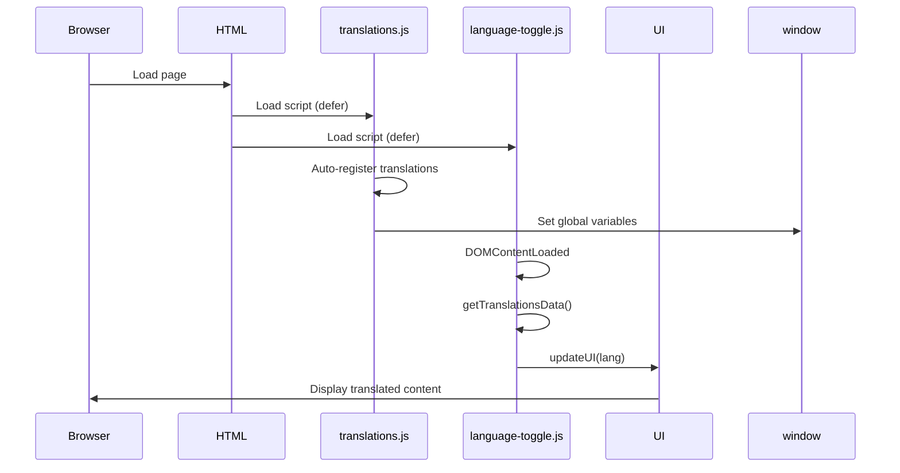
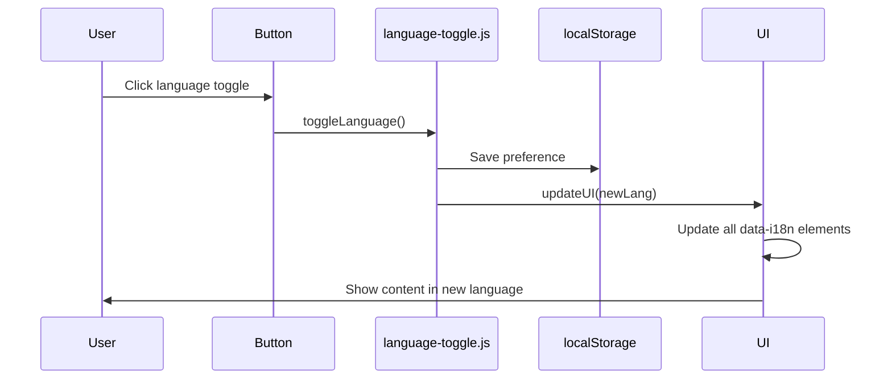

# Language Toggle System Documentation

## 📋 Tổng quan

Language Toggle System là một hệ thống đa ngôn ngữ (Vietnamese/English) được thiết kế cho Web Server Report project. Hệ thống cho phép người dùng chuyển đổi ngôn ngữ một cách mượt mà mà không cần reload trang.

## 🏗️ Kiến trúc hệ thống

```
Language Toggle System
├── Core Components
│   ├── language-toggle.js (Core logic)
│   ├── translations.js (Translation data)
│   └── language_toggle.html (UI component)
├── Integration Points
│   ├── HTML Templates
│   ├── data-i18n attributes
│   └── Static file serving
└── Auto-registration System
    ├── Dynamic loading
    ├── Fallback mechanisms
    └── Event-driven updates
```

## 📁 Cấu trúc tệp tin

### 1. Core Files

```
shared_components/core/
├── language-toggle.js          # Core JavaScript logic
├── theme-manager.js           # Theme system (separate)
└── ...

dashboards/crypto_dashboard/assets/
├── translations.js            # Translation data
├── dashboard-websocket.js     # WebSocket (separate)
└── ...

shared_components/
├── language_toggle.html       # UI component template
├── theme_toggle.html         # Theme toggle (separate)
└── ...
```

### 2. HTML Templates Integration

```
dashboards/
├── home.html                  # Homepage
├── crypto_dashboard/routes/reports/
│   ├── view.html             # Report view page
│   ├── list.html             # Report list page
│   └── pdf.html              # PDF template
└── ...
```

## 🔧 Thành phần chính

### 1. language-toggle.js

**Chức năng chính:**
- ✅ Quản lý state ngôn ngữ (localStorage)
- ✅ Dynamic translation loading (getTranslationsData)
- ✅ UI updates (updateUI function)
- ✅ Event handling (language change events)
- ✅ Integration với report visuals

**Key Functions:**
```javascript
// Dynamic data loading (không dùng global variable)
function getTranslationsData() {
    // Try multiple sources: function, global vars, fallback
}

// UI update logic
function updateUI(lang) {
    // Update DOM elements với data-i18n
    // Toggle visibility cho multi-language content
    // Update language manager
}

// Language preference management
function getPreferredLanguage() / setPreferredLanguage(lang)

// Event-driven architecture
document.addEventListener('DOMContentLoaded', ...)
window.addEventListener('languageChanged', ...)
```

### 2. translations.js

**Chức năng:**
- ✅ Chứa tất cả translation data
- ✅ Auto-registration mechanism
- ✅ Support cho nhiều categories

**Data Structure:**
```javascript
const translations_data = {
    // Category: Homepage
    'homepage-title': { vi: '...', en: '...' },
    'welcome-message': { vi: '...', en: '...' },
    
    // Category: Reports
    'site-title': { vi: '...', en: '...' },
    'created-at': { vi: '...', en: '...' },
    
    // Category: UI Elements
    'loading': { vi: '...', en: '...' },
    'close': { vi: '...', en: '...' },
}
```

**Auto-registration Logic:**
```javascript
(function() {
    function tryRegisterTranslations() {
        // Method 1: Use setTranslations if available
        // Method 2: Set global variables directly
        // Method 3: Event-driven retry
    }
})();
```

### 3. language_toggle.html

**UI Component:**
```html
<!-- Language toggle button với icon và text -->
<div id="language-toggle" class="...">
    <button class="...">
        <i class="fas fa-language"></i>
        <span class="lang-text">VI</span>
    </button>
</div>
```

## 🔄 Workflow hoạt động

### 1. Page Load Sequence



### 2. Language Switch Sequence



## 🎯 Integration Guide

### 1. Adding Language Toggle to New Page

**Step 1: Include HTML Component**
```html

```

**Step 2: Load Required Scripts**
```html
<script src="/crypto_dashboard/assets/translations.js" defer></script>
<script src="/shared_components/core/language-toggle.js" defer></script>
```

**Step 3: Add data-i18n Attributes**
```html
<h1 data-i18n="page-title">Default Title</h1>
<p data-i18n="description">Default description</p>
<button data-i18n="save-button">Save</button>
```

### 2. Adding New Translations

**Edit translations.js:**
```javascript
const translations_data = {
    // Add new keys
    'new-page-title': { vi: 'Tiêu đề mới', en: 'New Title' },
    'new-description': { vi: 'Mô tả mới', en: 'New Description' },
    // ... existing translations
};
```

### 3. Dynamic Content Translation

**Using Language Manager:**
```javascript
// Get translated text programmatically
const translatedText = window.languageManager.getTranslatedText('key');

// Format numbers with locale
const formattedNumber = window.languageManager.formatNumberLocalized(1234567);

// Listen for language changes
window.addEventListener('languageChanged', function(event) {
    const newLang = event.detail.language;
    // Update dynamic content
});
```

## 🛡️ Error Handling & Fallbacks

### 1. Loading Failures
- ✅ **Function not found**: Fallback to empty object
- ✅ **Script loading order**: Retry mechanism với setTimeout
- ✅ **Network issues**: Use cached data from localStorage

### 2. Missing Translations
- ✅ **Key not found**: Return original key as fallback
- ✅ **Language not supported**: Default to Vietnamese
- ✅ **Empty data**: Use fallback text

### 3. DOM Issues
- ✅ **Element not found**: Skip silently
- ✅ **Invalid HTML**: Use textContent instead of innerHTML
- ✅ **Race conditions**: Event-driven updates

## 📊 Performance Considerations

### 1. Loading Strategy
```javascript
// ✅ Dynamic loading - không global variables
function getTranslationsData() {
    // On-demand data retrieval
    // Multiple fallback sources
    // Caching in memory
}

// ❌ Old approach - global static variable
// let translations_data = get_translations_data(); // Dependency issue
```

### 2. Memory Usage
- ✅ **Lazy loading**: Translation data chỉ load khi cần
- ✅ **Shared data**: Global window variables để tránh duplicate
- ✅ **Event cleanup**: Proper event listener management

### 3. DOM Updates
- ✅ **Batch updates**: Update all elements once thay vì multiple DOM queries
- ✅ **Selective updates**: Chỉ update elements có data-i18n
- ✅ **Efficient selectors**: querySelectorAll cho bulk operations

## 🔍 Debugging Guide

### 1. Common Issues

**Problem**: Language toggle không hoạt động
```javascript
// Debug checklist:
console.log('Translation function:', typeof get_translations_data);
console.log('Global data:', window.translations_data);
console.log('Language manager:', window.languageManager);
console.log('Current language:', document.documentElement.lang);
```

**Problem**: Translations không xuất hiện
```javascript
// Check data-i18n elements
document.querySelectorAll('[data-i18n]').forEach(el => {
    console.log('Element:', el, 'Key:', el.getAttribute('data-i18n'));
});
```

**Problem**: Script loading errors
```javascript
// Check network requests trong DevTools
// Check file paths: /crypto_dashboard/assets/ vs /dashboards/...
```

### 2. Console Commands

```javascript
// Manual language switch
window.languageManager.currentLanguage = 'en';
// Force UI update
updateUI('en');

// Get translation data
const data = getTranslationsData();
console.log('Available keys:', Object.keys(data));

// Test specific translation
const text = window.languageManager.getTranslatedText('site-title');
console.log('Translated:', text);
```

## 🚀 Future Enhancements

### 1. Planned Features
- [ ] **More languages**: Chinese, Japanese, Korean support
- [ ] **URL-based language**: /en/reports vs /vi/reports
- [ ] **Auto-detection**: Browser language preference
- [ ] **RTL support**: Arabic, Hebrew languages
- [ ] **Translation management**: Admin interface

### 2. Performance Improvements
- [ ] **Bundle optimization**: Webpack/Rollup integration
- [ ] **Lazy loading**: Load translations on demand
- [ ] **Service worker**: Offline translation support
- [ ] **CDN integration**: External translation API

### 3. Developer Experience
- [ ] **TypeScript**: Type-safe translations
- [ ] **ESLint rules**: Translation key validation
- [ ] **Build-time checks**: Missing translation detection
- [ ] **Hot reload**: Development environment improvements

## 📝 Changelog

### v1.0.0 (Current)
- ✅ Basic Vietnamese/English support
- ✅ DOM-based translation với data-i18n
- ✅ LocalStorage persistence
- ✅ Event-driven architecture
- ✅ Dynamic loading system
- ✅ Integration với report system

### v0.9.0 (Previous)
- ❌ Global variable approach (removed)
- ❌ Static initialization (replaced with dynamic)
- ❌ Complex retry mechanism (simplified)

## 🤝 Contributing

### 1. Adding New Pages
1. Include language toggle component
2. Add data-i18n attributes
3. Load required scripts
4. Add translations to translations.js
5. Test both languages

### 2. Translation Guidelines
- **Keys**: Use kebab-case (homepage-title)
- **Categories**: Group related translations
- **Fallbacks**: Always provide both vi/en
- **Context**: Add comments cho complex translations

### 3. Code Style
```javascript
// ✅ Good: Descriptive function names
function getTranslationsData() { ... }
function updateUI(lang) { ... }

// ✅ Good: Error handling
try {
    const data = getTranslationsData();
} catch (error) {
    console.warn('Translation error:', error);
}

// ✅ Good: Event-driven updates
window.addEventListener('languageChanged', handleLanguageChange);
```

---

**Author**: AI Assistant  
**Version**: 1.0.0  
**Last Updated**: August 17, 2025  
**Project**: Web Server Report - Crypto Dashboard
