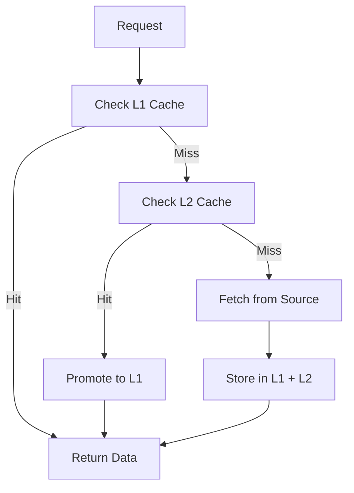

# Service Islands Workflow Guide

## 🚀 Quick Start Workflow

### Development Setup
```bash
# 1. Clone and setup
git clone <repository>
cd Web-server-Report

# 2. Install dependencies
cargo build

# 3. Setup Redis (required for L2 cache)
docker run -d --name redis -p 6379:6379 redis:alpine

# 4. Setup environment
export REDIS_URL="redis://127.0.0.1:6379"
export DATABASE_URL="postgresql://..."

# 5. Run server
cargo run --release
```

### First API Call Workflow
```bash
# Test system health
curl http://localhost:3000/health/system

# Test cache system  
curl http://localhost:3000/health/cache

# Make first crypto report request
curl http://localhost:3000/api/crypto-report/btc
```

## 🏗️ Service Islands Request Workflow

### 1. Incoming Request Flow

#### **Step 1: HTTP Request Arrives**
```
Client Request → Axum Router
                      ↓
                Layer 5: Business Logic
```

#### **Step 2: Business Logic Processing**
```rust
// In layer5_business_logic/crypto_reports_island.rs
pub async fn get_crypto_report(symbol: &str) -> Result<CryptoReport> {
    // 1. Validate input
    if !is_valid_symbol(symbol) {
        return Err(ValidationError);
    }
    
    // 2. Check cache first (Layer 1)
    let cache_key = format!("crypto_report_{}", symbol);
    
    // 3. Delegate to communication layer
    let market_data = self.communication_layer
        .get_market_data(symbol)
        .await?;
        
    // 4. Process business logic
    let report = self.generate_report(market_data).await?;
    
    Ok(report)
}
```

#### **Step 3: Communication Layer**
```rust
// In layer3_communication/data_communication_service.rs  
pub async fn get_market_data(symbol: &str) -> Result<MarketData> {
    // 1. Check if data exists in database (with L2 cache)
    if let Some(cached_data) = self.get_cached_data(symbol).await? {
        return Ok(cached_data);
    }
    
    // 2. Delegate to external services if cache miss
    let external_data = self.external_services_layer
        .fetch_market_data(symbol)
        .await?;
        
    // 3. Store in database and cache
    self.store_and_cache(symbol, &external_data).await?;
    
    Ok(external_data)
}
```

#### **Step 4: External Services Layer**
```rust
// In layer2_external_services/external_apis_island.rs
pub async fn fetch_market_data(symbol: &str) -> Result<MarketData> {
    // 1. Check rate limiting
    if !self.rate_limiter.can_proceed(symbol).await {
        return Err(RateLimitError);
    }
    
    // 2. Try multiple API sources with circuit breaker
    let data = self.api_aggregator
        .fetch_with_fallback(symbol)
        .await?;
        
    // 3. Update rate limiter
    self.rate_limiter.record_request(symbol).await;
    
    Ok(data)
}
```

#### **Step 5: Infrastructure Layer**
```rust
// In layer1_infrastructure/cache_system_island.rs
pub async fn get_cached_data<T>(key: &str) -> Option<T> {
    // 1. Check L1 Cache (Moka - in memory)
    if let Some(data) = self.l1_cache.get(key).await {
        return Some(data);
    }
    
    // 2. Check L2 Cache (Redis)
    if let Some(data) = self.l2_cache.get(key).await {
        // Promote to L1 for future requests
        self.l1_cache.set(key, data.clone()).await;
        return Some(data);
    }
    
    // 3. Cache miss
    None
}
```

### 2. Response Flow (Reverse Direction)

```
Database/API → Layer 1 (Cache) → Layer 2 (Transform) 
                    ↓
           Layer 3 (Store) → Layer 5 (Format) → HTTP Response
```

## 💾 Cache Strategy Workflows

### Cache-First Pattern


### Cache Strategy Selection
```rust
// Real-time data (30s TTL)
let btc_price = cache_manager.get_with_strategy(
    "btc_current_price", 
    CacheStrategy::RealTime
).await;

// Medium-term data (1hr TTL)  
let crypto_report = cache_manager.get_with_strategy(
    "crypto_report_btc", 
    CacheStrategy::MediumTerm
).await;

// Long-term data (3hr TTL)
let technical_analysis = cache_manager.get_with_strategy(
    "rsi_analysis_btc", 
    CacheStrategy::LongTerm  
).await;
```

### Cache Invalidation Workflow
```rust
// Manual invalidation
cache_manager.invalidate("crypto_report_btc").await;

// Pattern-based invalidation  
cache_manager.invalidate_pattern("crypto_report_*").await;

// TTL-based automatic invalidation (handled by cache system)
// No manual intervention required
```

## 🌐 WebSocket Real-time Workflow

### 1. Client Connection Flow
```
Client WebSocket Connect → Layer 3 WebSocket Service
                                ↓
                         Register Client Connection
                                ↓  
                         Start Background Data Fetcher
                                ↓
                         Layer 2 External APIs (Polling)
                                ↓
                         Layer 1 Cache Updates
                                ↓
                         Broadcast to All Clients
```

### 2. WebSocket Implementation
```rust
// In layer3_communication/websocket_service.rs
pub async fn handle_websocket_connection(socket: WebSocket) -> Result<()> {
    // 1. Register connection
    let client_id = self.register_client(socket).await;
    
    // 2. Start real-time data stream
    tokio::spawn(async move {
        loop {
            // Fetch latest data every 30 seconds
            let market_data = self.external_services
                .get_realtime_data()
                .await?;
                
            // Broadcast to all connected clients
            self.broadcast_to_clients(market_data).await?;
            
            tokio::time::sleep(Duration::from_secs(30)).await;
        }
    });
    
    Ok(())
}
```

### 3. Real-time Data Broadcasting
```rust
pub async fn broadcast_market_update(&self, data: MarketData) -> Result<()> {
    // 1. Update cache first
    self.cache_system.set_with_strategy(
        &data.cache_key(), 
        &data,
        CacheStrategy::RealTime
    ).await?;
    
    // 2. Broadcast to WebSocket clients
    let message = json!({
        "type": "market_update",
        "data": data,
        "timestamp": Utc::now()
    });
    
    for client in &self.connected_clients {
        client.send(message.clone()).await?;
    }
    
    Ok(())
}
```

## 🚨 Error Handling Workflows

### 1. Rate Limiting Recovery
```rust
// Exponential backoff implementation
pub async fn fetch_with_retry(&self, url: &str) -> Result<Response> {
    let mut attempts = 0;
    let max_attempts = 3;
    
    loop {
        match self.http_client.get(url).send().await {
            Ok(response) if response.status() == 429 => {
                attempts += 1;
                if attempts >= max_attempts {
                    return Err(RateLimitExceeded);
                }
                
                // Exponential backoff: 1s, 2s, 4s
                let delay = Duration::from_secs(2_u64.pow(attempts - 1));
                tokio::time::sleep(delay).await;
                continue;
            }
            Ok(response) => return Ok(response),
            Err(e) => return Err(e.into()),
        }
    }
}
```

### 2. Cache Failure Graceful Degradation  
```rust
pub async fn get_data_with_fallback(&self, key: &str) -> Result<Data> {
    // 1. Try cache first
    if let Ok(Some(data)) = self.cache_system.get(key).await {
        return Ok(data);
    }
    
    // 2. Cache failed, try database
    if let Ok(data) = self.database.get(key).await {
        // Try to populate cache for next time (fire and forget)
        let _ = self.cache_system.set(key, &data).await;
        return Ok(data);
    }
    
    // 3. Database failed, try external API
    let data = self.external_api.fetch(key).await?;
    
    // Try to store in both cache and database (fire and forget)
    let _ = self.cache_system.set(key, &data).await;
    let _ = self.database.store(key, &data).await;
    
    Ok(data)
}
```

### 3. Health Check Failure Workflow
```rust
pub async fn handle_health_check_failure(&self, component: &str) -> Result<()> {
    match component {
        "l1_cache" => {
            // L1 cache failed, can continue with L2 only
            self.cache_manager.disable_l1().await;
            warn!("L1 cache disabled, using L2 only");
        }
        "l2_cache" => {
            // L2 cache failed, use L1 + database direct
            self.cache_manager.disable_l2().await;
            warn!("L2 cache disabled, using L1 + database");
        }  
        "database" => {
            // Database failed, use cache-only mode
            self.database_manager.enable_cache_only_mode().await;
            error!("Database unavailable, cache-only mode enabled");
        }
        "external_apis" => {
            // External APIs failed, serve cached data only
            self.api_manager.enable_cache_only_mode().await;
            error!("External APIs unavailable, serving cached data");
        }
        _ => {
            error!("Unknown component health check failed: {}", component);
        }
    }
    
    Ok(())
}
```

## 📊 Monitoring & Observability Workflows

### 1. Health Check Endpoint Workflow
```rust
// GET /health/system
pub async fn system_health_check() -> Json<HealthStatus> {
    let mut status = HealthStatus::new();
    
    // Check each layer
    status.layer1 = self.check_infrastructure_health().await;
    status.layer2 = self.check_external_services_health().await;  
    status.layer3 = self.check_communication_health().await;
    status.layer5 = self.check_business_logic_health().await;
    
    // Overall status
    status.overall = status.all_healthy();
    status.timestamp = Utc::now();
    
    Json(status)
}
```

### 2. Cache Metrics Workflow
```rust
pub async fn get_cache_metrics() -> Json<CacheMetrics> {
    let l1_stats = self.l1_cache.get_statistics().await;
    let l2_stats = self.l2_cache.get_statistics().await;
    
    Json(CacheMetrics {
        l1_cache: L1Metrics {
            entries: l1_stats.entry_count(),
            hits: l1_stats.hit_count(),
            misses: l1_stats.miss_count(),
            hit_rate: l1_stats.hit_rate(),
        },
        l2_cache: L2Metrics {
            memory_usage: l2_stats.memory_usage(),
            connections: l2_stats.connection_count(),
            latency_avg: l2_stats.average_latency(),
        },
        cache_manager: CacheManagerMetrics {
            l1_promotions: self.cache_manager.l1_promotions(),
            fallbacks: self.cache_manager.fallback_count(),
            total_operations: self.cache_manager.total_operations(),
        }
    })
}
```

### 3. Performance Monitoring
```rust
use std::time::Instant;

pub async fn monitor_request_performance<F, T>(operation: F) -> Result<T> 
where
    F: Future<Output = Result<T>>,
{
    let start_time = Instant::now();
    
    let result = operation.await;
    
    let duration = start_time.elapsed();
    
    // Log performance metrics
    match &result {
        Ok(_) => {
            info!("Operation completed successfully in {:?}", duration);
            if duration > Duration::from_millis(1000) {
                warn!("Slow operation detected: {:?}", duration);
            }
        }
        Err(e) => {
            error!("Operation failed after {:?}: {:?}", duration, e);
        }
    }
    
    result
}
```

## 🔧 Development Workflows

### 1. Adding New Island Component

#### **Step 1: Create Island Structure**
```bash
# Create new island directory
mkdir -p src/service_islands/layer2_external_services/new_island

# Create files
touch src/service_islands/layer2_external_services/new_island/mod.rs
touch src/service_islands/layer2_external_services/new_island/component.rs
touch src/service_islands/layer2_external_services/new_island/README.md
```

#### **Step 2: Implement Standard Interface**
```rust
// In new_island/mod.rs
use async_trait::async_trait;

#[async_trait]
pub trait IslandComponent {
    async fn initialize() -> Result<Self> where Self: Sized;
    async fn health_check(&self) -> bool;
    async fn get_metrics(&self) -> serde_json::Value;
    async fn shutdown(&self) -> Result<()>;
}

pub struct NewIsland {
    // Island specific fields
}

#[async_trait]
impl IslandComponent for NewIsland {
    async fn initialize() -> Result<Self> {
        // Initialize island components
        Ok(NewIsland {})
    }
    
    async fn health_check(&self) -> bool {
        // Implement health check logic
        true
    }
    
    async fn get_metrics(&self) -> serde_json::Value {
        // Return island-specific metrics
        json!({
            "status": "healthy",
            "operations": 0
        })
    }
    
    async fn shutdown(&self) -> Result<()> {
        // Cleanup resources
        Ok(())
    }
}
```

#### **Step 3: Register in Layer**
```rust
// In layer2_external_services/mod.rs
pub mod new_island;
pub use new_island::NewIsland;

// In main.rs or app state
let new_island = NewIsland::initialize().await?;
```

### 2. Adding New Cache Strategy

```rust
// In layer1_infrastructure/cache_system_island/cache_manager.rs
#[derive(Clone, Debug)]
pub enum CacheStrategy {
    RealTime,    // 30s
    ShortTerm,   // 5min  
    MediumTerm,  // 1hr
    LongTerm,    // 3hr
    // Add new strategy
    VeryLongTerm, // 24hr
}

impl CacheStrategy {
    pub fn ttl(&self) -> Duration {
        match self {
            // ... existing strategies
            CacheStrategy::VeryLongTerm => Duration::from_secs(24 * 60 * 60),
        }
    }
}
```

### 3. Testing Workflow

#### **Unit Testing**
```rust
#[cfg(test)]
mod tests {
    use super::*;
    
    #[tokio::test]
    async fn test_cache_hit() {
        let cache = setup_test_cache().await;
        
        // Test L1 cache hit
        cache.set("test_key", "test_value").await;
        let result = cache.get("test_key").await;
        
        assert_eq!(result, Some("test_value".to_string()));
    }
    
    #[tokio::test]
    async fn test_cache_promotion() {
        let cache = setup_test_cache().await;
        
        // Store in L2 only
        cache.l2_cache.set("test_key", "test_value").await;
        
        // Get should promote to L1
        let result = cache.get("test_key").await;
        
        assert_eq!(result, Some("test_value".to_string()));
        assert!(cache.l1_cache.contains_key("test_key").await);
    }
}
```

#### **Integration Testing**  
```rust
#[tokio::test]
async fn test_end_to_end_crypto_report() {
    let app = setup_test_app().await;
    
    // Mock external API
    let mock_server = setup_mock_coingecko().await;
    
    // Test full request flow
    let response = app
        .get("/api/crypto-report/btc")
        .send()
        .await;
        
    assert_eq!(response.status(), 200);
    
    // Verify cache was populated
    let cache_key = "crypto_report_btc";
    assert!(app.cache_system.contains_key(cache_key).await);
}
```

## 🚀 Deployment Workflow

### 1. Production Deployment

```bash
# Build optimized release
cargo build --release

# Setup production Redis
docker run -d \
  --name redis-prod \
  --restart unless-stopped \
  -p 6379:6379 \
  redis:alpine

# Set production environment  
export RUST_ENV=production
export REDIS_URL="redis://127.0.0.1:6379"
export LOG_LEVEL=info

# Run with systemd or Docker
./target/release/web-server-report
```

### 2. Health Check Verification

```bash
# System health
curl http://localhost:3000/health/system

# Individual components
curl http://localhost:3000/health/cache
curl http://localhost:3000/health/external-apis
curl http://localhost:3000/health/database

# Performance metrics
curl http://localhost:3000/metrics/cache
curl http://localhost:3000/metrics/performance
```

### 3. Cache Warmup

```bash
# Pre-populate cache with frequently accessed data
curl http://localhost:3000/api/crypto-report/btc
curl http://localhost:3000/api/crypto-report/eth  
curl http://localhost:3000/api/market-data/global

# Verify cache population
curl http://localhost:3000/metrics/cache
```

## 🔍 Troubleshooting Workflows

### 1. High Memory Usage

```bash
# Check cache metrics
curl http://localhost:3000/metrics/cache

# If L1 cache too large, reduce max_capacity
# If L2 cache too large, check Redis memory usage
redis-cli INFO memory

# Manually clear cache if needed
redis-cli FLUSHALL
```

### 2. API Rate Limiting Issues

```bash
# Check external API health
curl http://localhost:3000/health/external-apis

# Monitor logs for 429 errors
tail -f server.log | grep "429"

# Verify exponential backoff is working
# Look for retry patterns in logs
```

### 3. Database Connection Issues

```bash
# Check database health
curl http://localhost:3000/health/database

# Verify cache-only mode if database down
# Should serve cached data without errors

# Check connection pool
curl http://localhost:3000/metrics/database
```

---

**Service Islands Workflow** cung cấp clear guidelines cho development, monitoring, và troubleshooting cryptocurrency reporting system với Service Islands Architecture.
